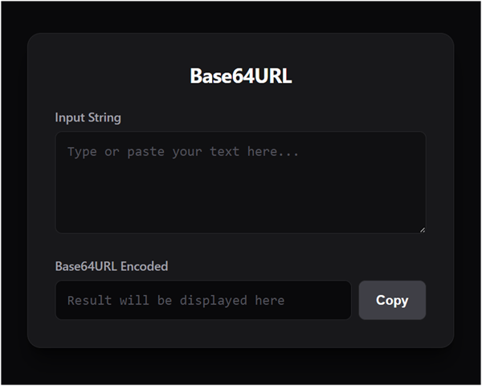

# Base64URL

It's a lightweight client-side web page for converting text strings into URL-safe Base64 (Base64URL) encoding.

## Features

* **Real-Time Conversion:** Encodes text instantly as you type.
* **URL-Safe Formatting:** Automatically transforms standard Base64 into Base64URL (RFC 4648) by replacing `+` with `-`, `/` with `_`, and stripping trailing `=` padding.
* **UTF-8 Support:** Accurately encodes special characters and emojis.
* **One-Click Copy:** Native clipboard integration with visual success feedback and graceful fallbacks for older browsers.
* **Fully Self-Contained:** Requires no external libraries required.

## Project Structure

The project is organized into three core files for clean separation of concerns:
* `index.html` - The layout structure.
* `style.css` - The styling and layout rules.
* `script.js` - The encoding logic and clipboard handling.

## Getting Started

Because this tool relies entirely on native browser APIs, there is no installation or build process required.

1. Clone this repository or download all three files (`index.html`, `style.css`, `script.js`) into the same folder.
2. Double-click `index.html` to open it in any web browser.
3. Type or paste your string into the input text box to generate the Base64URL output.

## Web Page Interface
